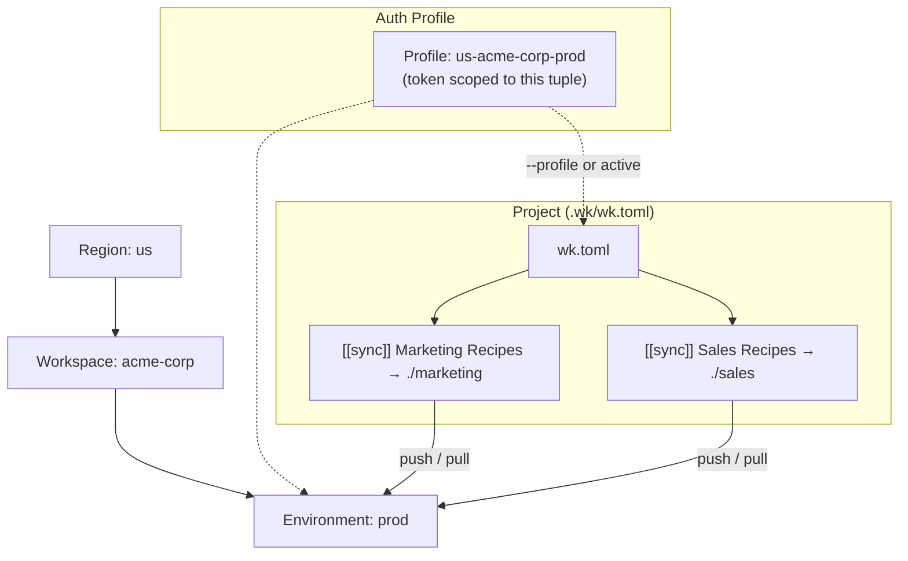

# wk

The CLI component of the [Workato Labs](https://github.com/workato-devs/labs) toolkit — workspace operations, recipe sync, and plugin system. See the Labs README for install instructions and the full toolkit overview.

## Getting started

### Authenticate

Before you can use the CLI, you need a Workato API token. Creating one
requires several steps in the Workato UI:

1. **Create a Client Role** — go to **Workspace admin > API clients > Client
   roles** and create a role with the permissions you need (projects,
   connections, recipes, lifecycle management, etc.)
2. **Create an API Client** — go to **Workspace admin > API clients**, create
   a client, assign the role, and specify environment/project access
3. **Copy the token** — the token (starts with `wrk`) is shown once at
   creation time

See the [Workato docs on API clients](https://docs.workato.com/en/platform-cli.html#authentication)
for the full walkthrough.

Once you have a token, create an auth profile:

```sh
wk auth login --token <your-token> --environment prod
```

`--token` and `--environment` are required — they can't be introspected.
Everything else (workspace name, workspace ID, email) is pulled from
`GET /users/me` after the token is validated. The profile name is
auto-computed as `<region>-<workspace-slug>-<environment>`.

The region defaults to `us`. Pass `--region` to override:

```sh
wk auth login --token <your-token> --environment prod --region eu
```

Valid regions: `us`, `eu`, `jp`, `au`, `sg`, `il`, `cn`, `trial` (Developer Sandbox).

```sh
wk auth list               # show all profiles
wk auth switch <profile>   # change active profile
wk auth status             # verify connectivity
```

Credentials are stored in the system keychain by default. For CI/CD, use
`--store-type file` to write a `profiles.env` credential file instead. See
[docs/ci-setup.md](./docs/ci-setup.md) for non-interactive flag requirements
and example pipelines.

### New project (greenfield)

```sh
wk init --project "Marketing Recipes" --project "Sales Recipes"
```

This creates a `wk` project container with a `.wk/` directory for CLI state and scaffolds local directories for each declared Workato project. The project name is derived from your active auth profile as `<region>-<workspace-slug>-<environment>`, keeping your project directory, auth profile, and workspace aligned automatically. Override with `--name` if needed.

After init, the directory looks like this:

```
us-acme-corp-prod/
├── .wk/                          # CLI state (gitignored)
│   ├── wk.toml                   # project config
│   └── .gitignore
├── Marketing Recipes/            # local directory for this Workato project
└── Sales Recipes/                # local directory for this Workato project
```

Pull to sync server content down to your local directories:

```sh
cd us-acme-corp-prod
wk pull
```

After pull, `.wk/` mirrors the asset tree with `.meta.json` sidecar files
that track each asset's server-side identity and content hash. These power
`wk status` and `wk diff`:

```
us-acme-corp-prod/
├── .wk/
│   ├── wk.toml
│   ├── .gitignore
│   ├── Marketing Recipes/
│   │   └── welcome-email.recipe.json.meta.json
│   └── Sales Recipes/
│       └── lead-sync.recipe.json.meta.json
├── Marketing Recipes/
│   └── welcome-email.recipe.json
└── Sales Recipes/
    └── lead-sync.recipe.json
```

```sh
wk status        # show what's changed locally vs. last pull
wk diff          # show content differences between local and remote
wk push          # push local changes to remote workspace
```

### Existing project (rehydration)

If you already have a local `wk` project layout, use `init --verify` to register it against a workspace:

```sh
wk init --projects-dir us-acme-corp-prod --verify
```

`--projects-dir` registers each immediate subdirectory of `us-acme-corp-prod` as a sync entry in `wk.toml`. `--verify` confirms each entry exists on the server and caches the resolved folder/project IDs.

Then pull to hydrate your local directories with the server's current state:

```sh
cd us-acme-corp-prod
wk pull
```

From here the workflow is the same — edit, status, diff, push.

## Commands

The CLI covers auth, recipes, connections, folders, tags, API Platform,
MCP, workspace management, sync, and plugins. Every command supports
`--json` for scripting and `--help` for usage details.

See [docs/command-reference.md](./docs/command-reference.md) for the full
command tree and global flags.

## Project config

An auth profile maps to an environment/workspace/region tuple. A project's
`wk.toml` declares which workspace it targets and what to sync.



Every `wk` project is defined by a `.wk/wk.toml` file. The CLI walks up from
the current directory to find it.

```toml
name = "us-acme-corp-prod"
description = "Production workspace recipes"
workspace = "acme-corp"
plugins = ["recipe-lint"]

[[sync]]
server_path = "/Marketing Recipes"
local_path = "./Marketing Recipes"
folder_id = 12345
project_id = 678

[[sync]]
server_path = "/Sales Recipes"
local_path = "./Sales Recipes"
folder_id = 12346
project_id = 679
```

| Field | Required | Purpose |
|---|---|---|
| `name` | yes | Project name (also the container directory name) |
| `workspace` | yes | Workspace identifier (matches auth profile) |
| `description` | no | Human-readable description |
| `plugins` | no | List of plugins to load |
| `[[sync]]` | yes | Array of server-path-to-local-path mappings |
| `server_path` | yes | Workato folder path on the server |
| `local_path` | yes | Local directory to sync into |
| `folder_id` | no | Cached Workato folder ID — populated by `--verify` or on first sync, avoids repeated folder-hierarchy API walks. Use `wk sync refresh` to re-resolve. |
| `project_id` | no | Cached Workato project ID — present only when the folder is a Workato project. Required for project-level operations (`folders delete` on projects). Zero/absent for plain folders. |
| `include` | no | Glob filter for which files to sync |

## Plugin system

Plugins extend `wk` with additional commands via JSON-RPC. A plugin is a
directory containing a `plugin.toml` manifest and a Go binary entrypoint.
The linter (`recipe-lint`) is the primary plugin.

```sh
wk plugins install ./recipe-lint     # install from a local directory
wk plugins list                      # list installed plugins
wk plugins remove <name>             # remove a plugin
```

### Plugin manifest format

```toml
name = "recipe-lint"
version = "0.1.0"
description = "Tiered recipe validation for Workato"
entrypoint = "./recipe-lint"

[[commands]]
name = "lint"
description = "Validate recipe files"
method = "lint.run"
```

## Development (CLI internals only)

This section is for contributors working on the `wk` CLI itself. If you're
using `wk` to build and deploy Workato recipes, you can stop reading here.

### Make targets

```sh
make build     # build to ./bin/wk
make test      # run all tests
make lint      # golangci-lint
make fmt       # gofmt
make tidy      # go mod tidy
make clean     # remove ./bin/
make install   # build + copy to $GOPATH/bin
```

### Project structure

```
cmd/wk/              Entry point (main.go)
internal/
  commands/          Cobra command definitions and RunContext
  api/               Workato API client
  auth/              Credential storage, profiles, regions
  config/            wk.toml parsing and project root discovery
  sync/              Pull/push sync logic
  plugin/            Plugin loading and JSON-RPC dispatch
  output/            Text and JSON formatters
  errors/            Structured error types
plugins/             Bundled plugin examples
```

### Release

Releases are built with [GoReleaser](https://goreleaser.com/). Cross-compiled
binaries are produced for linux, darwin, and windows on amd64 and arm64.

```sh
goreleaser release --snapshot --clean
```

## License

See [LICENSE](LICENSE).
